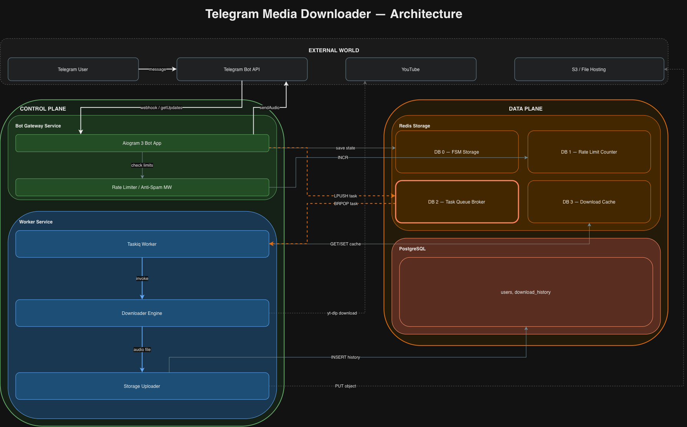

# Kelseir

Асинхронный Telegram-бот для скачивания аудио с YouTube. Принимает ссылку в чате, скачивает медиа в фоне, загружает результат во внешнее хранилище и отдаёт пользователю готовый файл.



---

## Содержание

- [Как это работает](#как-это-работает)
- [Архитектура](#архитектура)
- [Стек](#стек)
- [Структура проекта](#структура-проекта)

---

## Как это работает

1. Пользователь отправляет ссылку на YouTube в чат.
2. Бот валидирует ссылку, проверяет лимиты и кладёт задачу в очередь.
3. Отдельный воркер-процесс забирает задачу из очереди.
4. Воркер скачивает аудио через `yt-dlp`, конвертирует через `ffmpeg`.
5. Готовый файл загружается в S3-совместимое хранилище.
6. Метаданные записываются в PostgreSQL, ссылка кэшируется в Redis.
7. Бот отправляет пользователю готовый аудиофайл.

Ключевой момент: **скачивание не блокирует бота**. Все тяжёлые операции выполняются в отдельном worker-процессе и общаются с ботом только через Redis-очередь.

---

## Архитектура

Схема разделена на три контура.

### External World

Внешние системы, с которыми взаимодействует сервис.

| Компонент | Роль |
|---|---|
| **Telegram User** | Пользователь, инициирующий запрос. |
| **Telegram Bot API** | Приём апдейтов (webhook) и отправка ответов (`sendAudio`). |
| **YouTube** | Источник медиа (`yt-dlp`). |
| **S3 / File Hosting** | Внешнее хранилище готовых аудиофайлов. |

### Control Plane

Логика сервиса. Состоит из двух независимых процессов.

**Bot Gateway Service** — постоянно работает, обрабатывает апдейты:

| Компонент | Роль |
|---|---|
| **Aiogram 3 Bot App** | Принимает апдейты, валидирует ссылки, сохраняет FSM, ставит задачи в очередь, отправляет результат пользователю. |
| **Rate Limiter / Anti-Spam Middleware** | Проверяет лимиты пользователя через Redis DB 1, блокирует флуд. |

**Worker Service** — отдельный процесс, слушает очередь:

| Компонент | Роль |
|---|---|
| **Taskiq Worker** | Consumer очереди Redis DB 2. Оркеструет пайплайн скачивания. |
| **Downloader Engine** | `yt-dlp + ffmpeg` — извлечение метаданных, скачивание, конвертация. |
| **Storage Uploader** | Загрузка результата в S3, запись истории в PostgreSQL. |

### Data Plane

Хранилища данных.

**Redis Storage** — один инстанс, 4 логические БД:

| База | Назначение | Кто использует |
|---|---|---|
| **DB 0 — FSM Storage** | Состояния диалогов Aiogram. | Aiogram (rw) |
| **DB 1 — Rate Limit Counter** | Счётчики запросов. | Rate Limiter MW (rw) |
| **DB 2 — Task Queue Broker** | Очередь задач Taskiq. Узкое место. | Aiogram (w) → Taskiq Worker (r) |
| **DB 3 — Download Cache** | Кэш готовых ссылок с TTL. | Taskiq Worker (rw) |

**PostgreSQL** — постоянное хранилище метаданных:

| Таблица | Что хранит |
|---|---|
| **users** | Telegram ID, username, дата регистрации, настройки. |
| **download_history** | Ссылка на YouTube, ссылка на S3, кто запросил, когда, размер. |

### Жизненный цикл одной задачи

```
Telegram User
    │ message
    ▼
Telegram Bot API ──► Aiogram 3 Bot App
                         │
                         ▼
                   Rate Limiter MW ──► Redis DB 1 (INCR)
                         │
                         ▼
                   Redis DB 0 (save state)
                         │
                         ▼
                   Redis DB 2 (LPUSH task) ──► Taskiq Worker (BRPOP)
                                                    │
                                                    ▼
                                              Downloader Engine ──► YouTube
                                                    │
                                                    ▼
                                              Storage Uploader ──► S3
                                                    │
                                                    ▼
                                              PostgreSQL (INSERT history)
                                                    │
                                                    ▼
                                              Redis DB 3 (cache)
                                                    │
                                                    ▼
                                              Aiogram 3 Bot App ──► Telegram Bot API
                                                                        │ sendAudio
                                                                        ▼
                                                                  Telegram User
```

### Ключевые решения

- **Асинхронность через очередь.** Bot Gateway и Worker не знают друг о друге напрямую. Единственная точка соприкосновения — Redis DB 2. Позволяет масштабировать воркеры горизонтально и не блокировать бота.
- **Разделение control plane и data plane.** Логика отделена от данных — проще менять хранилища и находить узкие места.
- **Redis как мультиролевой компонент.** FSM, лимиты, очередь и кэш — четыре разные по природе вещи в одном инстансе, но в разных БД. Экономит инфраструктуру.
- **Кэш с TTL.** Повторный запрос на ту же ссылку отдаётся мгновенно из DB 3, минуя пайплайн.
- **Внешнее хранилище.** Файлы не оседают на диске сервера — сразу загружаются в S3.

---

## Стек

| Слой | Технология                      |
|---|---------------------------------|
| Язык | Python 3.11+                    |
| Telegram | Aiogram 3                       |
| Очередь задач | Taskiq + Redis broker           |
| Кэш и FSM | Redis 7                         |
| БД | PostgreSQL 15                   |
| ORM | SQLAlchemy 2.0                  |
| Скачивание | yt-dlp + ffmpeg                 |
| Хранилище | S3-совместимое (MinIO / AWS S3) |
| Конфиг | pydantic-settings               |
| Логи | loguru                          |

---
