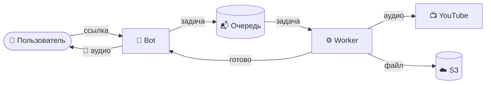

<div align="center">

# 🎵 Kelseir

**Асинхронный Telegram-бот для скачивания аудио с YouTube**

Принимает ссылку → скачивает в фоне через worker → загружает в S3 → отдаёт готовый файл

[](https://python.org)
[](https://aiogram.dev)
[](https://taskiq-python.github.io)
[](https://postgresql.org)
[](https://redis.io)
[](LICENSE)

[Документация](https://github.com/IgorMogilin/kelseir/wiki) ·
[Issues](https://github.com/IgorMogilin/kelseir/issues) ·
[Projects](https://github.com/IgorMogilin/kelseir/projects) ·
[Wiki](https://github.com/IgorMogilin/kelseir/wiki)

</div>

---

## ⚡ Как это работает



**Ключевое:** скачивание не блокирует бота. Тяжёлые операции — в отдельном worker-процессе, связь через Redis-очередь.

---

## 🚀 Быстрый старт

### Требования
Python 3.11+ · Docker · uv

### Запуск

```bash
# 1. Клонировать
git clone https://github.com/IgorMogilin/kelseir.git
cd kelseir

# 2. Поднять инфраструктуру (Redis, PostgreSQL, MinIO)
docker-compose up -d

# 3. Настроить окружение
cp .env.example .env
# → заполнить BOT_TOKEN, REDIS_URL, PG_URL, S3_*

# 4. Установить зависимости
uv sync

# 5. Применить миграции
alembic upgrade head

# 6. Запустить бота
python main.py

# 7. Запустить воркер (в отдельном терминале)
taskiq worker worker:broker
```

📖 **Подробная инструкция** — в [Wiki → Настройка окружения](https://github.com/IgorMogilin/kelseir/wiki/Development-Setup)

---

## 🧱 Стек

| Слой | Технология |
|------|------------|
| Язык | Python 3.11+ |
| Telegram | Aiogram 3 |
| Очередь | Taskiq + Redis |
| БД | PostgreSQL 15 + SQLAlchemy 2.0 |
| Скачивание | yt-dlp + ffmpeg |
| Хранилище | S3-совместимое (MinIO / AWS) |
| Конфиг | pydantic-settings |
| Логи | loguru |

---

## 📚 Документация

Вся подробная документация — в **[Wiki](https://github.com/IgorMogilin/kelseir/wiki)**:

| | Раздел | О чём |
|---|--------|-------|
| 🏗 | [Архитектура](https://github.com/IgorMogilin/kelseir/wiki/Architecture) | Схема сервиса, жизненный цикл задачи |
| ⚙️ | [Конфигурация](https://github.com/IgorMogilin/kelseir/wiki/Configuration) | Переменные окружения, Redis DB |
| 🛠 | [Настройка окружения](https://github.com/IgorMogilin/kelseir/wiki/Development-Setup) | Локальный запуск с нуля |
| 🤖 | [Bot Gateway](https://github.com/IgorMogilin/kelseir/wiki/Bot-Gateway) | Aiogram, FSM, Rate Limiter |
| ⚙️ | [Worker Service](https://github.com/IgorMogilin/kelseir/wiki/Worker-Service) | Taskiq, yt-dlp, S3, кэш |
| 🚢 | [Деплой](https://github.com/IgorMogilin/kelseir/wiki/Deployment) | Развёртывание на сервере |
| 🧪 | [Тестирование](https://github.com/IgorMogilin/kelseir/wiki/Testing) | Тесты, линтеры, CI |

---

## 📁 Структура проекта

```
kelseir/
├── bot/          # Bot Gateway (Aiogram 3)
├── worker/       # Worker Service (Taskiq)
├── core/         # Общая логика (конфиг, логгер, БД, S3)
├── docs/         # Документация и схемы
├── tests/        # Тесты
├── main.py       # Точка входа бота
├── pyproject.toml
└── docker-compose.yml
```

---

## 🎯 Статус

**Веха:** `v0.1.0 — MVP` 🚧 в разработке

Прогресс и задачи — на [канбан-доске](https://github.com/IgorMogilin/kelseir/projects).

---

<div align="center">

<sub>Сделано с ❤️ для тех, кто любит музыку</sub>

</div>
